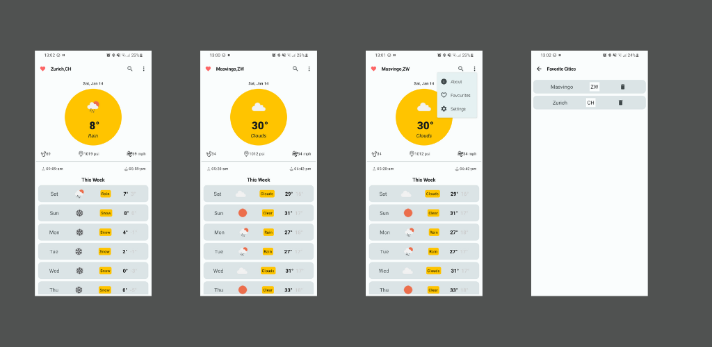

# Jetpack Compose Weather App

#Architecture

This **Weather app** follows the
[official architecture guidance](https://developer.android.com/topic/architecture) 
and is described in detail in the
[architecture learning journey](docs/ArchitectureLearningJourney.md).

**Libraries & Dependencies**
- Material 3 Design https://m3.material.io/components
- Square [Retrofit] / [Okhttp] / [Logging-Interceptor]
- Hilt and Dagger
- Room database
- Kotlin couroutines
